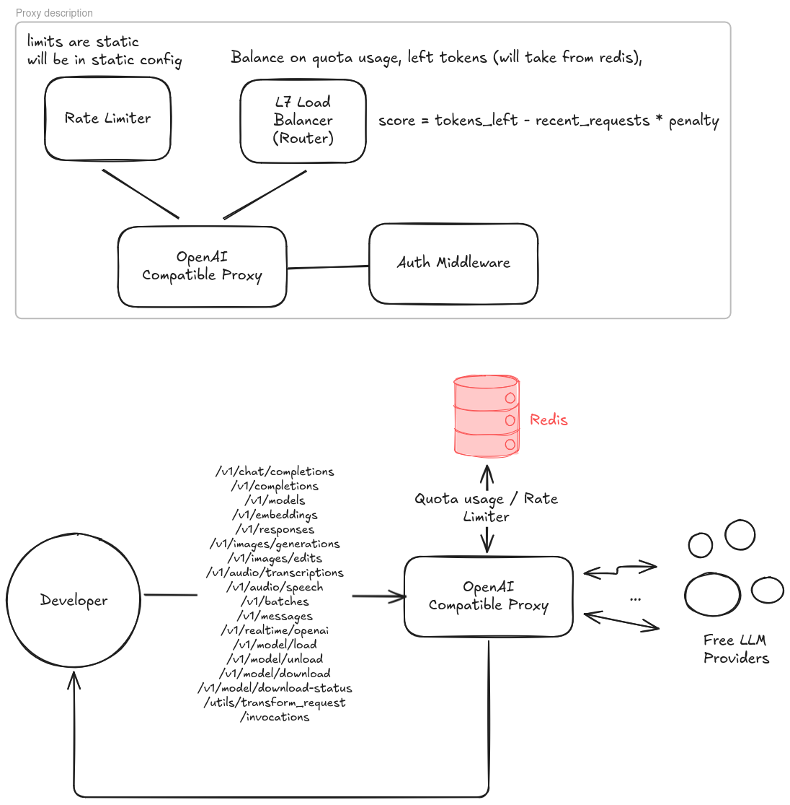

Список эндпоинтов для OpenAI-совместимых и сопутствующих LLM-сервисов:
• /v1/chat/completions — основной эндпоинт для генерации текста и чата.
• /v1/completions — эндпоинт для завершения текста (Legacy).
• /v1/models — получение списка доступных моделей.
• /v1/embeddings — создание векторных представлений текста.
• /v1/responses — современный API на замену чат-комплитов (/v1/chat/completions), также используется для Codex.
• /v1/images/generations — генерация изображений.
• /v1/images/edits — редактирование изображений.
• /v1/audio/transcriptions — расшифровка аудио в текст.
• /v1/audio/speech — генерация речи из текста.
• /v1/batches — пакетная обработка запросов.
• /v1/messages — эндпоинт для совместимости с форматом Anthropic (Claude).
• /v1/realtime/openai — работа с Realtime API через веб-сокеты (wss).
• /v1/model/load — загрузка модели в память (LM Studio).
• /v1/model/unload — выгрузка модели (LM Studio).
• /v1/model/download — скачивание модели (LM Studio).
• /v1/model/download-status — статус скачивания (LM Studio).
• /utils/transform_request — отладочный эндпоинт для просмотра трансформации запроса (LiteLLM).
• /invocations — эндпоинт для работы с Messages API в Amazon SageMaker.

Нативные эндпоинты Ollama:
• /api/generate.
• /api/chat.
• /api/embeddings.
• /api/tags (List models).
• /api/ps (List running models).
• /api/show.
• /api/create.
• /api/copy.
• /api/pull.
• /api/push.
• /api/delete.
• /api/version.

# Schema

